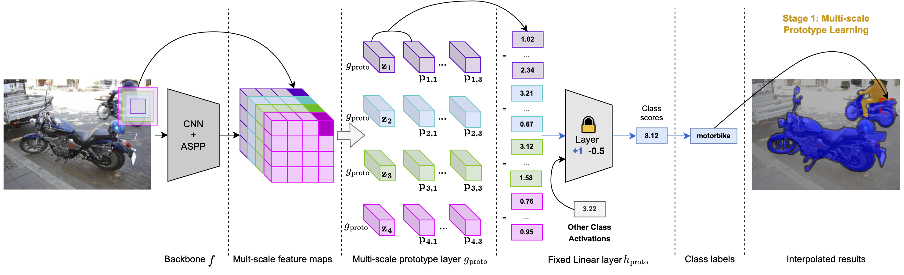
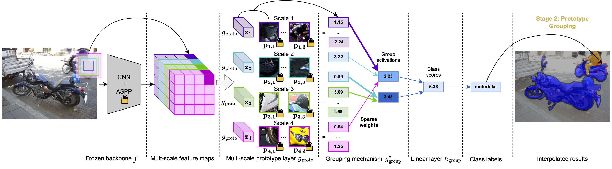
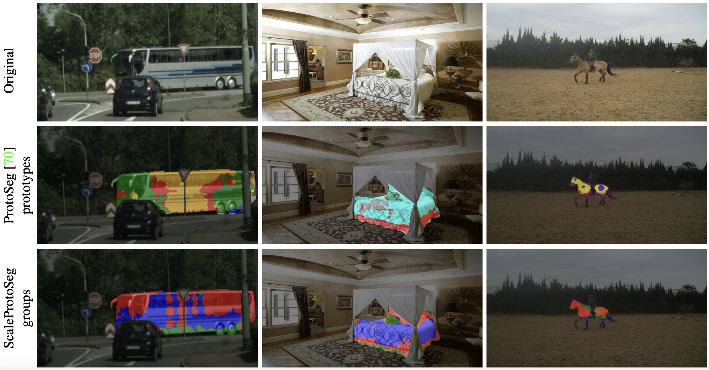

# ⚖️ ScaleProtoSeg: WACV 2025


[](https://zenodo.org/record/14946772)

**Prototype Learning**:

**Grouping Mechanism**


>  📑 Multi-Scale Grouped Prototypes for Interpretable Semantic Segmentation <br>
> ✍️ [Hugo Porta](https://scholar.google.com/citations?user=IQMApuoAAAAJ&hl=fr), [Emanuele Dalsasso](https://scholar.google.com/citations?user=4bfkX98AAAAJ&hl=it), [Diego Marcos](https://scholar.google.ch/citations?user=IUqydU0AAAAJ&hl=en) and [Devis Tuia](https://scholar.google.com/citations?user=p3iJiLIAAAAJ&hl=fr) <br>
> *[WACV 2025](https://openaccess.thecvf.com/content/WACV2025/papers/Porta_Multi-Scale_Grouped_Prototypes_for_Interpretable_Semantic_Segmentation_WACV_2025_paper.pdf)*

This repository is a fork of the code for [ProtoSeg](https://github.com/gmum/proto-segmentation).

## 🛠️ Installation

Install python libraries and local code:

```
pip install -r requirements/requirements.txt
```

For using Deeplab it might be necessary to run:

```
pip install git+https://github.com/lucasb-eyer/pydensecrf.git --no-build-isolation
```

⚠️ The file `.env_template` is here to provide an example of environment file necessary to run this repository.

## 💽 Data

### Downloading Data

- <u>Cityscapes:</u> Download at this [link](https://www.cityscapes-dataset.com/downloads) the images: **leftImgbit_trainvaltest.zip**, the labels: **gtFine_trainvaltest.zip**, and the parts annotations: **gtFinePanopticParts_trainval.zip**.

- <u>Pascal:</u> Follow the instructions detailed at this [link](https://github.com/kazuto1011/deeplab-pytorch/blob/master/data/datasets/voc12/README.md) for the images and labels.
    - Pascal data: VOC2012 can be downloaded [here](http://host.robots.ox.ac.uk/pascal/VOC/voc2012/VOCtrainval_11-May-2012.tar).
    - Augmented training data: **SegmentationClassAug** can be downloaded at this [link](https://www.dropbox.com/scl/fi/xccys1fus0utdioi7nj4d/SegmentationClassAug.zip?rlkey=0wl8iz6sc40b3qf6nidun4rez&e=1&dl=0).
    - The splits: **SegmentationAug** can be found [here](https://github.com/kazuto1011/deeplab-pytorch/files/2945588/list.zip).
    - The data needs to be extended with the test set available [here](http://host.robots.ox.ac.uk:8080/eval/downloads/VOC2012test.tar) when registered to the benchmark, it is just necessary to copy the test images from **JPEGImages** in the corresponding folders for train, trainaug, and val.
    - The parts annotations can be found [here](https://onedrive.live.com/?authkey=%21AHXfIdeL14IeVhI&id=F5D23EA0E1A6E588%21108&cid=F5D23EA0E1A6E588&parId=root&parQt=sharedby&o=OneUp) and the `parts.yaml` should be copied from this [file](https://github.com/pmeletis/panoptic_parts/blob/45f7121cf2d4bfe65e6dc27b3f006d1104841ae1/panoptic_parts/specs/dataset_specs/ppp_datasetspec.yaml). All those data should be placed in the same folder as the rest of the Pascal benchmark. Rename the folders in **labels** to **train** and **val**.

- <u>ADE20K:</u> The scene parsing dataset can be downloaded [here](http://data.csail.mit.edu/places/ADEchallenge/ADEChallengeData2016.zip).

- <u>EM:</u> The dataset for the segmentation of neuronal structures in EM stacks challenge - ISBI 2012 can be found [here](https://downloads.imagej.net/ISBI-2012-challenge.zip)

- <u>COCO-Stuff:</u> The COCO 2017 train, and validation images can be found at this [link]([https://github.com/nightrome/cocostuff?tab=readme-ov-file#downloads]) with the Stuff+thing annotations. In the target COCO-Stuff folder move the images from **train2017.zip** and **val2017.zip** folders to **images/train** and **images/val**. Similarly, move the annotations from **stuffthingmaps_trainval2017.zip** to **annotations_png/train** and **annotations_png/val**.

### Preprocessing Data

#### Cityscapes

```
# replace <N> with the number of parallel jobs
python -m segmentation.data.preprocess_cityscapes <N> # for cityscapes
python -m segmentation.data.img_to_numpy --margin-size 0 --data-type cityscapes
python -m segmentation.data.preprocess_part_cityscapes preprocess-cityscapes <N> # for cityscapes
```

#### Pascal

```
# replace <N> with the number of parallel jobs
python -m segmentation.data.preprocess_pascal <N> # for pascal
python -m segmentation.data.img_to_numpy --margin-size 0 --data-type pascal
python -m segmentation.data.preprocess_part_pascal <N> # for pascal
```

#### ADE20K

```
# replace <N> with the number of parallel jobs
python -m segmentation.data.preprocess_ade <N> # for ade
python -m segmentation.data.img_to_numpy --margin-size 0 --data-type ade
```

#### EM

In EM preprocessing you can specify a seed to create different train/val splits from the original train data. In the paper we tested our models against two different random splits.

```
# replace <N> with the number of parallel jobs
python -m segmentation.data.preprocess_em <N> --seed 42 # for EM
python -m segmentation.data.img_to_numpy --margin-size 0 --data-type em
```

#### COCO-Stuff

```
# replace <N> with the number of parallel jobs
python -m segmentation.data.preprocess_coco <N> # for COCO
python -m segmentation.data.img_to_numpy --margin-size 0 --data-type coco
```

## 💪 Training

All the checkpoints for ScaleProtoSeg can be downloaded at the following [Zenodo Link](https://zenodo.org/record/14946772).

### ScaleProtoSeg
```
# Example for cityscapes: Prototype Learning
python -m segmentation.train_wandb_multiscale scaleproto_cityscapes <your_training_run_name>

# Example for cityscapes: Grouping Mechanism
python -m segmentation.finetune_wandb_group group_scaleproto_cityscapes <your_training_run_name>
```

In the folder **segmentation/configs** all the config files follow a similar naming pattern than the one in the example above.

You need to specify for the **grouping** the path of the checkpoints from the first phase: `train.start_checkpoint` parameter.

### ProtoSeg

```
# Example for cityscapes: Prototype Learning
python -m segmentation.train_wandb baseline_cityscapes <your_training_run_name>

# Example for cityscapes: Pruning
python -m segmentation.run_pruning baseline_cityscapes <your_training_run_name>

# Example for cityscapes: Finetuning
python -m segmentation.train_wandb baseline_cityscapes <your_training_run_name> --pruned
```

Please look at the file `train_wandb.py` and `train_wandb_multiscale.py` for manual modifications when training on EM.

## 🧪 Evaluation

### ScaleProtoSeg

```
# Setting to zero the quasi non-used prototypes
python -m segmentation.analysis.threshold_save <your_training_run_name> <training_stage> <threshold>

# Evaluation on validation set
python -m segmentation.eval_valid_multiscale <your_training_run_name> <training_stage> <batch_size> <data_type>

# Generating predictions on cityscapes or pascal test set
python -m segmentation.eval_test  <your_training_run_name> <training_stage> <batch_size> <flag_pascal>

# Evaluation for consistency metric (same for stability)
python -m segmentation.analysis.consistency <prototype_training_run_name> <training_stage> <data_type> <quantile> <threshold> <group_training_run_name>
```

### ProtoSeg

```
# Evaluation on validation set for Pascal or Cityscapes
python -m segmentation.eval_valid <your_training_run_name> <training_stage> <flag_pascal>

# Evaluation on validation set for ADE, COCO, or EM
python -m segmentation.eval_valid_multiscale <your_training_run_name> <training_stage> <batch_size> <data_type>

# Generating predictions on cityscapes or pascal test set
python -m segmentation.eval_test  <your_training_run_name> <training_stage> <batch_size> <flag_pascal>

# Evaluation for consistency metric (same for stability)
python -m segmentation.analysis.consistency <prototype_training_run_name> <training_stage> <data_type> <quantile> <threshold>
```

For testing it is necessary to then properly arrange the output folder to match the benchmarks requirements online.

## 🥇 Performance

On the validation sets, we report the results over 3 runs, while for the test sets, the results are based on [ProtoSeg](https://arxiv.org/abs/2301.12276) and our best ScaleProtoSeg validation run.

| Method                | Cityscapes (val) | Cityscapes (test) | Pascal (val) | Pascal (test) | ADE20K (val) |
|----------------------|----------------|----------------|-------------|--------------|--------------|
| DeepLabv2 [[Chen et al. 2017]](https://arxiv.org/abs/1606.00915) | 71.40 | 70.40 | 77.69 | 79.70 | 34.00 |
| ProtoSeg [[Sacha et al. 2023]](https://arxiv.org/abs/2301.12276) | 67.54 ± 0.22 | 67.04 | **71.98 ± 0.11** | **72.92** | 29.67 ± 0.23 |
| ScaleProtoSeg        | **68.97 ± 0.25** | **68.52** | 71.80 ± 0.38 | 72.35 | **34.18 ± 0.18** |

## Analysis

In the folder `segmentation/analysis` numerous scripts are available to investigate the interpretability of our model via different plotting strategy.

**Prototype Maps**:

**Grouping Mechanism**


## 🖋️ Citation
```
@InProceedings{Porta_2025_WACV,
    author    = {Porta, Hugo and Dalsasso, Emanuele and Marcos, Diego and Tuia, Devis},
    title     = {Multi-Scale Grouped Prototypes for Interpretable Semantic Segmentation},
    booktitle = {Proceedings of the Winter Conference on Applications of Computer Vision (WACV)},
    month     = {February},
    year      = {2025},
    pages     = {2869-2880}
}
```
